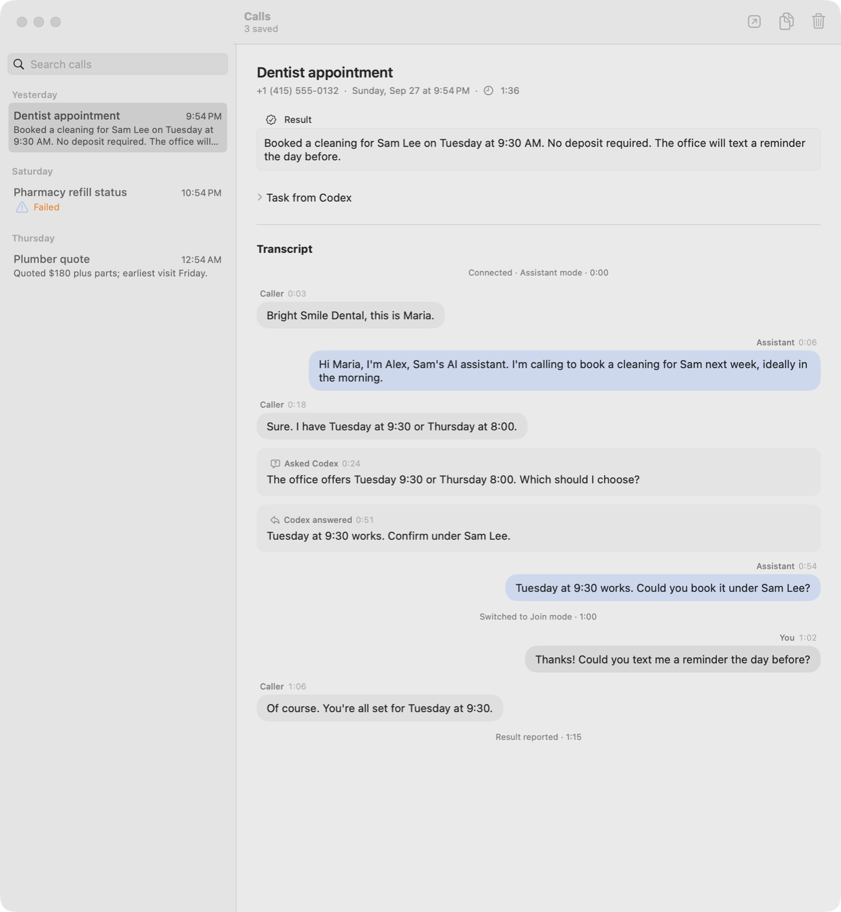

# Phone Assistant for Codex

Ask Codex to make a call, and an AI voice assistant handles it through your Mac's Phone app, on your own number. You can listen in, join, or take over at any time from a control in the notch. When the call ends, the result goes back to the Codex task that asked for it, and the transcript stays on your Mac.

<picture>
  <source media="(prefers-color-scheme: dark)" srcset="docs/images/call-history-dark.png">
  
</picture>

## How it works

1. **Codex prepares the call.** With the bundled MCP tools, Codex describes the task ("book a cleaning next week, check with me before confirming") and gets back a session. Codex stays in charge of the task; the call is one tool it uses.
2. **Codex places the call.** It dials from your iPhone's number through Phone on your Mac (macOS may ask you to confirm), or you start the call yourself. When the call starts, Phone Assistant connects its audio and selects itself as Phone's microphone.
3. **The assistant talks.** A realtime voice model speaks with the caller. When it needs a fact or a decision, it asks the originating Codex task and waits for the answer.
4. **You stay in control.** The notch widget offers Listen, Join, Take over, and mute. The assistant is told who is on the call in each mode, and holds back when you're speaking.
5. **The result goes back to Codex.** The assistant reports the outcome, attributing each agreement to the right person. If the summary isn't enough, Codex can read the transcript with `call_transcript`.

Caller statements are treated as untrusted information, never as instructions. The assistant introduces itself the way you choose, and always says it's an AI if asked.

## Features

- **Notch control** for the live call, attached to the camera housing on notched displays.
- **Call history** with each call's result, the task, Codex's questions and answers, and a conversation-style transcript.
- **Speaker-labeled transcripts:** the caller and your microphone are transcribed separately and on-device with Apple's Speech framework (macOS 26 and later), so lines read Caller, You, or Assistant.
- **Auto-connect:** a prepared call connects when the Phone call starts.
- **Native Mac app:** follows the system appearance and accent color. The API key is kept in the Keychain.

## Requirements

- An Apple Silicon Mac with macOS 26 or later, which has the Phone app, set to English.
- Calls from your iPhone allowed on this Mac: on the iPhone, Settings → Phone → Calls on Other Devices.
- Codex, and an OpenAI API key for the voice model.
- Xcode, and an Apple Development signing identity to build. The app installs a signed audio driver and a privileged helper.

## Build and run

```sh
./script/build_and_run.sh
```

Building never installs a system component or restarts audio. If you have more than one signing identity, set `PHONE_KIT_SIGNING_IDENTITY`. For distribution builds (Developer ID signing and notarization), see [distribution](docs/distribution-scope.md#distribution-build).

Run the checks:

```sh
./script/test_native.sh
PHONE_KIT_TEST_SIGNING=1 python3 script/test_driver.py
PHONE_KIT_TEST_SIGNING=1 python3 script/test_phone_kit.py
```

## Set up

1. **Audio:** enable Phone Assistant Audio Bridge (needs administrator approval), system audio access, and Accessibility access so the app can select its microphone in Phone. Microphone access is optional; it lets you speak on calls.
2. **Assistant:** choose its name, voice, and how it introduces itself.
3. **Connections:** in Settings → Connections, add your API key and choose Connect to Codex. Start a new Codex task to load the tools.

Then ask Codex to make a call. For example: *"Call the dentist at +1 415 555 0132 and book a cleaning next week, mornings if possible. Check with me before confirming."*

## Privacy

- Transcripts and results are saved on your Mac for 30 days by default. You can turn off transcript saving or keep calls forever in Settings → History.
- On-device transcription never leaves the Mac. The voice model receives only the audio the current mode allows; in Just me, nothing reaches it.
- Some places require everyone on a call to consent to it being recorded or transcribed. Check the rules where you and the other person are.

## Documentation

See the [documentation index](docs/README.md) for the architecture, the Codex tool contract, audio routing, and call history. [Security](docs/security.md) describes the privileged helper, the driver, and the trust boundaries.

## Status

This is a working prototype. Hanging up stays manual. It has automated coverage for audio routing, the voice session, the MCP tools, history, and transcription, but real calls with a remote listener are still being qualified, including echo without headphones, device changes, and long calls. It isn't yet notarized for distribution.

## License

[MIT](LICENSE). The audio driver is based on Apple's sample code, whose license is kept in [native/Driver/APPLE-LICENSE.txt](native/Driver/APPLE-LICENSE.txt).
