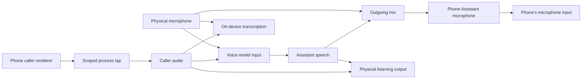

# Architecture

Phone Assistant is a native macOS app. It owns capture, mixing, monitoring, outgoing audio, the voice session, and the Codex connection. There is no local server. The app talks to the voice model directly over a URLSession WebSocket, and to Codex through the bundled `CallMCP` executable. See the [Phone bridge](phone-bridge.md) for routing and the voice session, and the [Codex connection](codex-connection.md) for the tools.

## Audio ownership

The CallAudio library owns the real audio paths. Its C DSP target supplies preallocated, bounded queues and routing controls; its Swift worker owns device selection, conversion, tap and aggregate lifetime, and PCM delivery. `PhoneBridgeStore` controls it for each call.

The participation mode enables each connection in this graph. Caller audio is never a source for the outgoing mix. Assistant speech is decoded directly into the native queues rather than played through an ordinary output and captured again.

The capture selector requires one active Phone renderer. It refuses ambiguous attribution, simultaneous FaceTime use, and any fallback to whole-system capture. The private aggregate contains the tap without a physical input that could accidentally become caller audio.

For managed listening, the tap mutes the original renderer while it's consumed, so the app's physical listening output is the only caller playback path. Stopping capture restores Phone's ordinary playback. Physical listening and microphone endpoints can follow macOS defaults or use a fixed device; see [automatic devices](automatic-devices.md).

## Participation

`PhoneRouting` selects independently who speaks to the caller and who hears the caller. The notch presents these as Assistant, Listen, Join, Take over, and Just me; the assistant is told who is on the call in each mode. See [call participation](call-participation.md).

## Transcription

Before caller and microphone audio are mixed for the assistant, the worker hands each source to on-device transcription (macOS 26 and later), but only when the assistant is authorized to hear that source. Lines are labeled by the source their audio came from. See [call history](call-history.md).

## Voice session

`LiveVoiceSession` connects to the realtime voice model and applies the assistant's identity, introduction, style, pace, and the Codex task at session creation. A Responses delegate reasons about the task and has two tools, `ask_codex` and `report_call_result`, both bound to the originating Codex task. Changing who speaks or who the assistant hears starts a fresh session with the new mode; the task and a bounded transcript carry over as context.

Both local and provider-facing queues are bounded. Overflow, malformed PCM, transport loss, or a broken route closes delivery and reports an error. Stale packets from a retired session can't restart speech, and late model events or delegate answers can't affect a replacement session.

Core Audio callbacks do no network requests, JSON or base64 work, file writes, or UI updates. Those belong to the worker and control paths. Stop closes audio gates immediately; teardown is handled separately from speech cancellation.

## The virtual microphone

`CodexCallSend.driver` publishes the input-only **Phone Assistant** microphone and a hidden output feed that only the app writes. It provides stereo Float32 at a fixed 48 kHz with a declared 512-frame transport delay. Missing, stale, or invalid audio becomes silence. Network access, models, credentials, and transcripts stay outside the driver. See the [virtual microphone contract](virtual-microphone.md).

Phone Assistant Audio Bridge bundles the driver and a privileged installer inside the app. Enable checks the payload's identity, asks for administrator approval, installs the exact payload, and restarts Core Audio if activation is needed. It never changes default devices, restarts the Mac, or changes security settings. See [bridge installation](phone-kit-installation.md).

## Responsibilities

- **CallAudio:** native samples, routing controls, device validation, meters, and cleanup.
- **PhoneBridgeStore:** a call's route lifetime, voice connection, and transcription.
- **CodexPhoneSessionStore:** the MCP tools, the fixed return address to the originating task, and call history events.
- **CallHistoryStore:** saved calls and retention.
- **Phone:** the carrier call. Dialing and hangup stay manual.

No path in normal operation sets the system default input, output, or alert device. Virtual devices are routing endpoints, not access control against other apps running as the same user. With the microphone on, it can still pick up the speakers acoustically; headphones give the cleanest calls.

## References

- [Capturing system audio with Core Audio taps](https://developer.apple.com/documentation/coreaudio/capturing-system-audio-with-core-audio-taps)
- [Creating an Audio Server driver plug-in](https://developer.apple.com/documentation/coreaudio/creating-an-audio-server-driver-plug-in)
- [SpeechAnalyzer](https://developer.apple.com/documentation/speech/speechanalyzer)
