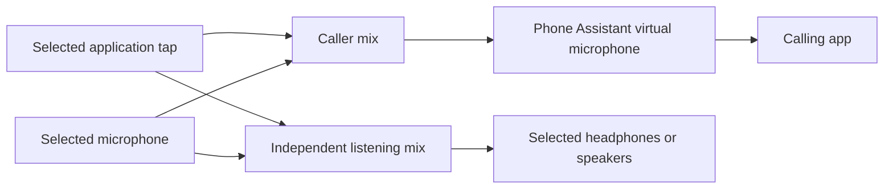

# Portable Phone Assistant routing

The native app now provides one application source, one optional physical microphone, one optional physical listening output, and the bundled Phone Assistant virtual microphone. It does not provide an arbitrary audio graph, effects rack, system-wide routing, automatic dialing, or automatic device selection in calling apps other than Phone. Phone microphone selection uses Accessibility access.

These routing controls now live in **Settings → Advanced**. The ordinary app opens assistant onboarding and then the notch controls. See [assistant setup and everyday use](assistant-experience.md) for the saved profile and remaining voice/call integration.

## Routing behavior

- User-facing virtual microphone: **Phone Assistant**.
- Bundled setup component: **Phone Assistant Audio Bridge**.
- Stable app ID `com.codexcall.menu`, helper ID `com.codexcall.phonekit.helper`, driver ID `com.codexcall.audio.send`, device UID `com.codexcall.audio.send.device`, factory UUID, executable, and installation path remain unchanged.
- Running applications are discovered dynamically. Capture includes only the selected main process and verified, contained descendant helpers. Chrome's verified code-sign clone layout remains supported.
- Physical inputs and outputs are enumerated through Core Audio. No MacBook device name or object ID is required. New configurations and the Chrome preset use Automatic for microphone and listening output. Each independently follows the current macOS default. Existing saved device UIDs remain fixed overrides until Automatic is selected.
- Selections and gains live in the existing app's UserDefaults domain under `audioRouting.v1`. Application identity combines bundle ID, signing team, and canonical bundle location, excluding PIDs. Device identity uses the Core Audio UID. Names are only labels.
- Missing selections remain saved and visible. In Automatic, physical device and supported sample-rate changes replace the affected endpoint without rebuilding the application tap or virtual send route. A missing automatic endpoint pauses that path and retries. Explicit missing devices, application restarts, or changed renderer lists still stop the route. See [automatic devices](automatic-devices.md).



Every input-to-destination connection in this diagram is an explicit checkbox. Use a separate calling application from the captured source; browser tabs are not isolated from one another. The app's ordinary playback is muted only while its tap is running. Other applications and system default devices are untouched. Caller mute masks only the caller routes; it preserves requested local listening. Stop and Quit close the routes, flush buffered audio, release owned capture/output devices, and restore ordinary application playback. The calling app continues to own incoming-call playback.

## Audio limits

The bridge mixes to mono and duplicates that signal across destination channels. It accepts native Float32 PCM at 8–192 kHz and converts on the worker to the virtual microphone's fixed 48 kHz or the listening device's actual rate. It does not change hardware sample rates. Unsupported formats return a visible error. Physical format changes rebuild converters automatically. A changed virtual-device or application-capture format still stops the route. The microphone and captured application have shared per-source gains across their selected destinations; caller peaks are limited.

`ApplicationAudioRuntime` owns application capture, conversion, and caller/listening queues. `CallAudioRuntime` owns the direct Phone bridge, including generated PCM and audience/epoch controls. The Advanced application test has no GPT-Live session. Phone uses a separate diagnostic path; FaceTime and this app are excluded from generic application capture. Out-of-bundle shared renderers are not inferred, so capture is not supported for every macOS application.

## Setup and upgrade

The app contains the complete kit. Enable or Update uses its native setup screen and administrator authorization. There are no separate downloads, kernel extensions, Apple Events Automation or Full Disk Access requests, or screen-video capture. Automatic Phone microphone selection requires Accessibility access. App capture uses System Audio Access; microphone capture uses optional Microphone Access.

The installer checks active audio before installation or activation and again before reconnecting Core Audio. Never update during a call. A previous driver is accepted only by the entire trusted legacy payload fingerprint, or by the same publisher's valid signature, expected bundle identity and a lower version. The helper stages the new payload, rechecks the old bytes, and atomically swaps the existing directory. The old payload is kept under a non-driver staging name until activation succeeds. Unknown, tampered, or newer versions are preserved. A same-version re-sign of identical code is accepted only with the same publisher, code-directory hash, and non-executable resource hashes; a different signing time alone does not force another driver update. A failed activation leaves an explicit setup error and may retain the backup for diagnosis; it never silently requests weaker security settings.

Use **Update Phone Assistant Audio Bridge** when setup reports an available update. Saved caller-app selections can continue using the unchanged device UID, but must be checked after activation.

## Distribution build

Recipients need an Apple Silicon Mac with macOS 26 or later, where Phone places iPhone calls, set to English. The app's deployment target is lower (macOS 14.2), but calls depend on Phone, and only macOS 27 has been qualified. Only the packaged `.app` is required on a recipient's Mac; Xcode, source code, and the developer's project directory are unnecessary for local routing.

Development builds choose one installed Apple Development identity, or an explicitly configured identity. They derive the real Team ID from its certificate. No developer-specific certificate fingerprint or Team ID is hardcoded. The driver has a build-location-independent Mach-O install name. The app bundle contains no project paths or local server configuration.

For a distribution build, set `PHONE_KIT_SIGNING_IDENTITY` to a Developer ID Application certificate and `PHONE_KIT_BUILD_VERSION` to a monotonically increasing helper version, then run:

```sh
./script/package_release.sh
```

For an explicitly requested notarization submission, configure an existing `notarytool` keychain profile in `PHONE_KIT_NOTARY_PROFILE` and run:

```sh
./script/package_release.sh --notarize
```

The script builds release code, signs the app, helper and driver, and packages the app in `dist/Phone-Assistant.dmg` beside an Applications shortcut, then signs the disk image. With `--notarize` it submits the disk image, staples the ticket to it, and checks it as Gatekeeper will. It refuses ad-hoc/test or Apple Development signing for distribution. A signed disk image alone is not notarization. See [Apple's distribution requirements](https://developer.apple.com/documentation/security/notarizing-macos-software-before-distribution).

## Qualification still required

- Repeat the in-place privileged update on other supported macOS versions. It completed on this development Mac and was verified by installed payload, device UID, display name, and one-driver checks.
- A clean Apple Silicon Mac with no prior permissions, helper, development tools, or virtual driver.
- Minimum supported macOS and other supported OS versions.
- USB/Bluetooth reconnects, long-duration clock drift, sleep/wake, and physical devices at different sample rates.
- Independent remote listener confirmation of application audio, microphone, intelligibility, mute, isolation, and absence of echo on an actual call.
- Developer ID Application signing, successful notarization/stapling, and Gatekeeper launch from the distributed disk image.

Automated tests and local meters never count as a successful Phone call.
